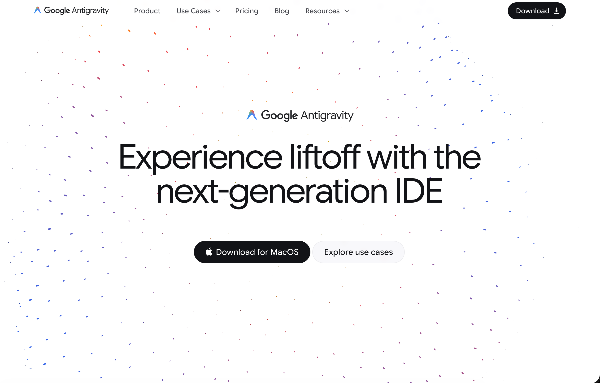
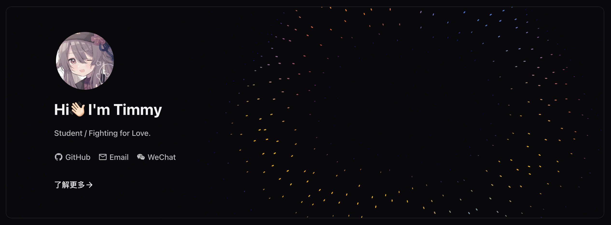
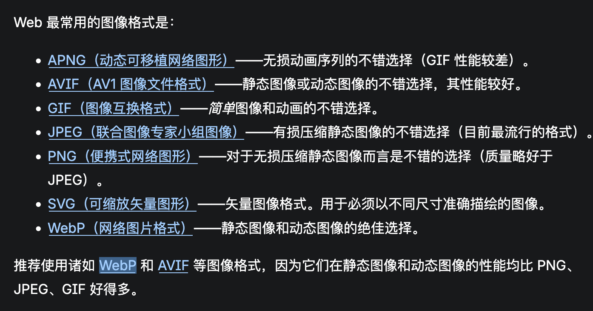
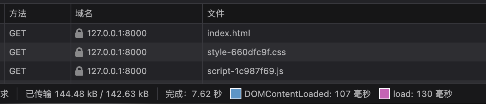
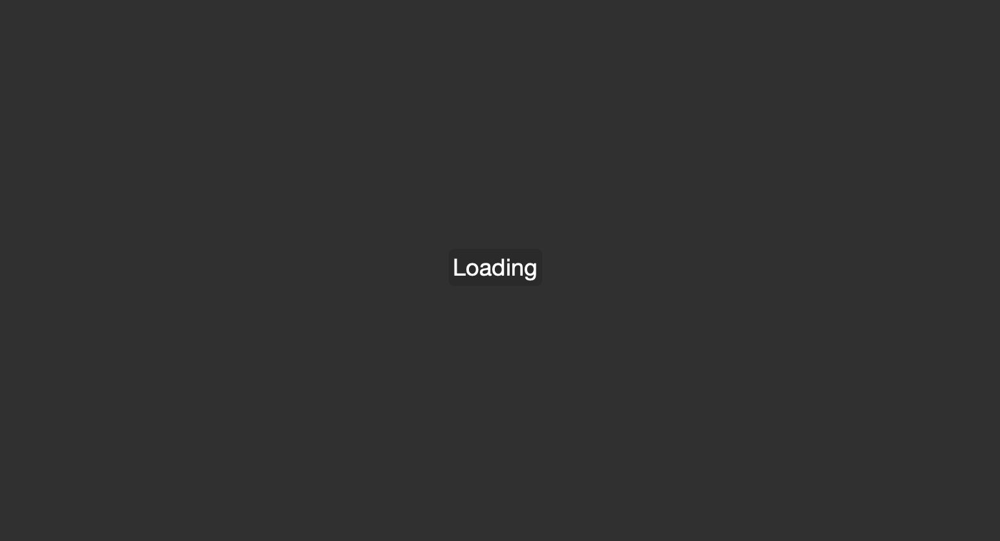
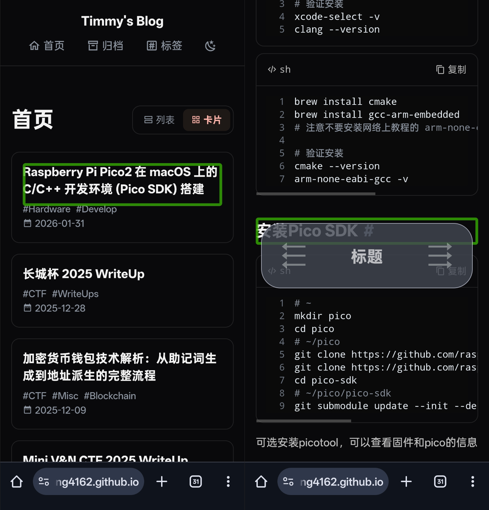
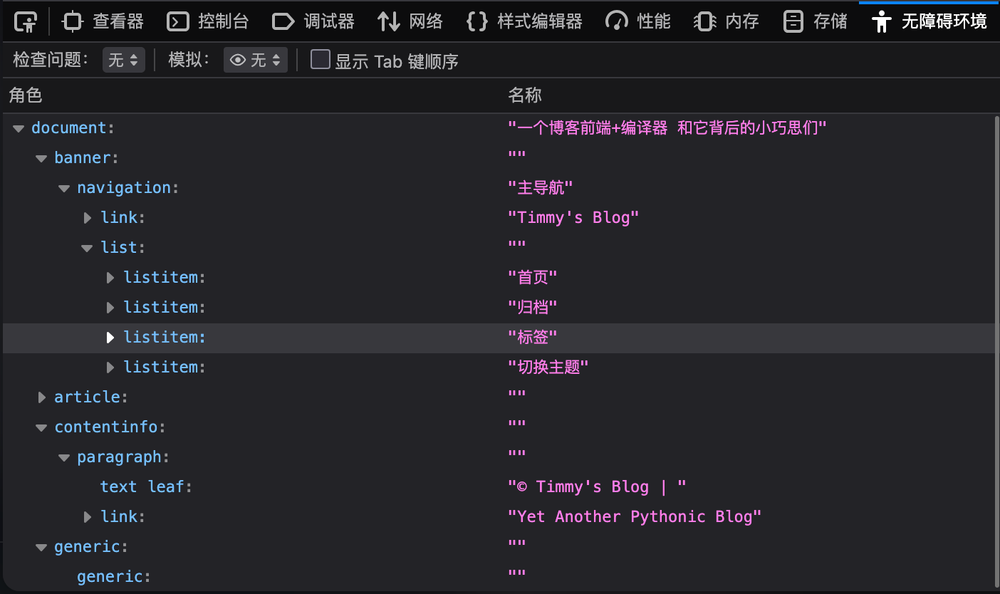
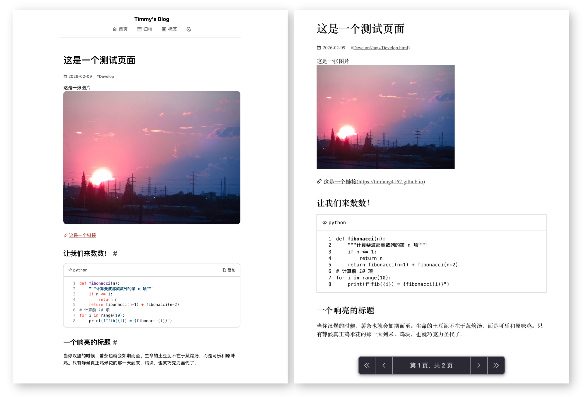
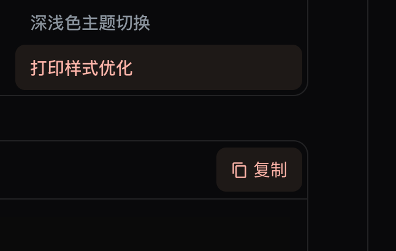
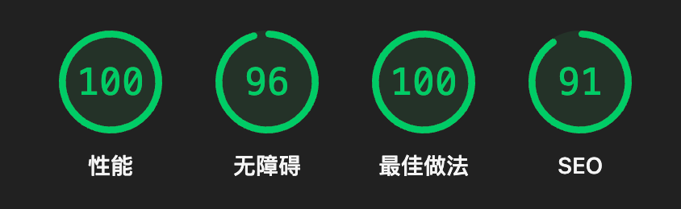

## 为什么造轮子

背景：玩过Wordpress（使用[Mdx](https://flyhigher.top/develop/788.html)主题，这是一个现代且优秀的主题）和Hexo，后来使用Hugo，但是我对主题和Hugo进行了非常多的魔改，维护压力大，于是重写一个。
~~对于大部分人来说，其实是先选择主题再确定博客系统。有时甚至会为了一套主题而迁移博客系统到另一个。~~

需求/设计理念：

1. 纯静态，构建产物需要尽力压缩，低带宽网络下性能良好
2. 客户端尽可能不使用js，所有渲染应该在服务端完成
3. 编译快速，严格缓存，最小化更改，不重复计算。部署方便，适合CI构建
4. 页面结构简单，以易于阅读为第一指标，没有花里胡哨的动画、播放器
5. 使用尽可能新的Web规范，不考虑太多的向后兼容性
6. 使用[typst](https://typst.app/)作为数学公式渲染器，而不是latex/katex/mathjax。我不喜欢latex。
7. 自用，不做成框架，不考虑解耦、模块化

## 技术选型

| 语言                  | Python                                                      |
| --------------------- | ----------------------------------------------------------- |
| Markdown解释器 渲染器 | [Mistune](https://github.com/lepture/mistune)，经过大量定制 |
| 模板渲染              | Jinja                                                       |
| 图像处理              | Pillow                                                      |
| 代码块高亮            | [pygments](https://pygments.org/)                           |
| mermaid渲染           | [mmdr](https://github.com/1jehuang/mermaid-rs-renderer)     |

一个静态博客编译器本身并没有太多好讲的地方，无非是把md文件转换成html


## 一些设计的小巧思

### banner动画

参考了Google Antigravity的背景，使用threejs复刻




可惜没有原版的灵动
感觉在深色模式下更有感觉（？

### 缓存机制

- 当一篇文章成功编译时，记录文章md5，将文章标记为已缓存
  - 当再次编译时，如果文章md5值一样，则不必重新编译
- 当文章内的`图片/mermaid图/typst代码块`被成功渲染时，也记录其md5
  - 当一篇文章只修改了md文本，而没有修改`图片/mermaid图/typst代码块`时，则只需要重新渲染md，不必重新渲染这些资源
  - `图片/mermaid图/typst代码块`的处理非常耗时，所以应当强缓存+并行处理
- 记录`static/`目录的md5，其中js和css文件以哈希值命名
  - 当修改了js或css时，强制重新构建所有页面（因为引用的文件的哈希值变化）

这样能确保改动后进行最小化更新

### 孤儿资源清理

1. 只有被md引用的图片会被打包进构建产物
2. 每次编译时记录所有引用的图片，删除构建目录下所有未被引用的资源

这样能确保构建目录不会越堆越大（相当于是自动清理过时的缓存）

### 目录哈希锚点

默认情况下，渲染器会为md文件中的每个标题生成id

```markdown
## 你好
```

```html
<h2 id="#%E4%BD%A0%E5%A5%BD">你好</h2>
```

这会造成两个问题：

1. url只允许ascii字符，其他字符会被百分号编码，这样又长又不美观
2. 当两个标题文本一样时，无法正确跳转
   例如：

   ```markdown
   # misc
   ## week1
   # web
   ## week1
   ```

   这两个标题的文本、id一模一样，但在语义上属于不同的分类

解决办法很简单，只需要手动指定一个`唯一`且`纯ascii`的id就行了，例如GitHub支持这样的语法

```markdown
### My Great Heading {#custom-id}
```

但是这样还是太麻烦了，我决定直接放弃语义化的id，使用哈希值作为id

```python
hash("#misc##week1")[:8] # 20f51fb2
```

这样能确保每个id都是唯一的，而且只和其目录层级相关

### 并行编译

- 所有页面都依赖静态资源，所以静态资源应当最先处理
- 归档页、标签页、首页等页面依赖文章数据，应当最后处理
- 每一篇文章是独立的，大量文章可以同时渲染
- 文章内的图片、图表、公式可以并发渲染

## 前端优化

大量使用了现代Web规范

### 图片

#### 图片压缩+响应式图片

1. 所有图片都会被转换为webp，并生成不同尺寸的小图片
   webp具有优秀的压缩率，且支持透明度、动图
   
2. 前端使用图片的`srcset`和`sizes`属性，根据实际显示尺寸获取对应尺寸的图片

例如

```html

```

参见[响应式图片](https://developer.mozilla.org/zh-CN/docs/Web/HTML/Guides/Responsive_images)

#### 懒加载

例如

```html

```

`loading="lazy"`会使图片只在进入视口时被加载，以节约带宽


#### 指定宽高并添加占位符

当一个没有设置宽高的图片被加载时，它的尺寸会从0x0变为图片尺寸，这会造成图片后的内容位置偏移。提前设置宽高可以使图片在未加载时也能保持正确的尺寸，可以避免[布局偏移(CLS)](https://web.dev/articles/cls)。同时添加占位符（例如文本或背景色）可以告诉用户此处有正在加载的图片。

```html

```



### 无障碍

#### HTML语义化 + ARIA地标

语义化HTML是可访问性的基础，但很多网站做得并不好。看看两种写法的区别：

```html
<!-- div套div -->
<div class="nav">
  <a href="/">首页</a>
</div>

<div class="post">
  <div class="title">文章标题</div>
  <div class="content">文章内容...</div>
</div>

<div class="sidebar">目录</div>

<div class="footer">页脚</div>
```

这种写法对普通用户没问题，但对使用屏幕阅读器的视障用户来说就是灾难。他们只能听到"链接"、"标题"，不知道这些内容的功能是什么。

再看语义化写法：

```html
<nav aria-label="主导航">
  <a href="/" rel="home">首页</a>
</nav>

<article>
  <header>
    <h1>文章标题</h1>
    <time datetime="2026-02-18">2026年2月18日</time>
  </header>

  <main>
    文章内容...
  </main>
</article>

<aside aria-label="文章目录">
  目录...
</aside>

<footer role="contentinfo">
  © 2026 作者名
</footer>
```

现在屏幕阅读器用户可以直接跳转到"导航"、"主要内容"、"补充信息"等区域，浏览效率大大提升。
参见[语义化元素](https://developer.mozilla.org/zh-CN/docs/Glossary/Semantics#%E8%AF%AD%E4%B9%89%E5%8C%96%E5%85%83%E7%B4%A0)，例如：

- `header` 标签标记页眉，默认样式同 `div`，不要把它和 `head` 搞混了
- `main` 标签标记页面的主要内容，默认样式同 `div`
- `article` 标签标记文章（在 HTML 5 中它指任何独立或可复用的文本），默认样式同 `div`
- `footer` 标签标记页脚，默认样式同 `div`
- `nav` 标签标记页面导航栏区域，默认样式同 `div`
- `aside` 标签标记侧栏，默认样式同 `div`
- `section` 标签标记“一组内容”，你可以把它看作是划定网页中一块区域的通用标签，默认样式同 `div`

另外这里有几个细节值得注意：

1. **`<time>`标签配合`datetime`属性**：`datetime`提供机器可读的日期格式（`2026-02-18`），而标签内容是中文格式（`2026年2月18日`），这样搜索引擎和日历应用都能正确识别。

2. **`rel="tag"`和`rel="home"`**：提供链接的语义关系，对SEO友好。

3. **`role="contentinfo"`**：虽然`<footer>`标签已经隐含了这个role，显式声明可以让屏幕阅读器朗读出"内容信息区域"。参见[ARIA角色](https://developer.mozilla.org/zh-CN/docs/Web/Accessibility/ARIA/Reference/Roles)

还可以试试打开手机上的TalkBack功能，闭上眼睛浏览博客，找找那些没有正确适配的地方：



#### 深浅色主题切换

页面的样式大量使用了css变量，因此，为深浅色制作不同的主题相当轻松

```css
[data-theme="dark"] {
  /* Dark theme overrides */
  --color-text: #bcbcbc;
  --color-text-strong: #f3f3f3;
  --color-text-secondary: #8b949e;
  --color-text-accent: #feb4a9;
  --color-background: #09090b;
  --color-background-secondary: #161616;
  --color-background-accent: #1e1917;
  --color-border: #222224;
}
```

但是代码块默认是深色的，mermaid、typst默认是浅色的，有一个小trick是，为他们添加反色的filter，即可快速获得另一种主题的样式

```css
.typst-picture,
.math-block,
.math-inline,
.mermaid-diagram {
  filter: invert()hue-rotate(180deg);
}
```

在反色的同时旋转色相180°，也就等同于在保持色相不变的同时将明度反转。你可以切换颜色模式并观察上面的代码块的色彩变化。

另外，可以使用`@media (prefers-color-scheme: dark)`媒体查询来获取用户偏好的主题，以此来设置页面初始时的主题。

#### 打印样式优化

使用 @media print {...} 可以创建只在打印页面时生效的样式。通过这种方式可以让页面在打印时应用一套为打印优化的样式，增强页面在物理纸张上的可访问性。
由于在打印的情况下，页面已经离开了“可交互”的范围，还有分页这种在屏幕中无需考虑的问题，要让页面在物理纸张上仍能被轻松地阅读，我们需要做一些特殊的适配。


主要优化如下：

- 强制浅色模式，白底黑字，增强对比度
- 移除了顶栏、复制按钮等元素，因为其在纸张上无法交互
- 使用衬线字体，优化纸张上的阅读体验
- 在链接后显示url、使用下划线标记链接
- 限制图片宽度为60%
- 强制代码块在溢出时换行，而不是在屏幕上可以左右滑动
- 避免在标题后分页、避免在图片中间分页

### 其他

#### 同心圆角



#### 统一主题色


本来想做成Material Design You的取色背景色的，但考虑到其两极分化的评价，最终没有采用。

#### Lighthouse评分



#### 移动端响应式优化

还行...

## 参考资料

- [MDx 中增强页面可访问性的细节](https://flyhigher.top/develop/1912.html)
- [Web Performance](https://web.dev/performance/)
- [ARIA Authoring Practices Guide](https://www.w3.org/WAI/ARIA/apg/)
- [Core Web Vitals](https://web.dev/vitals/)
